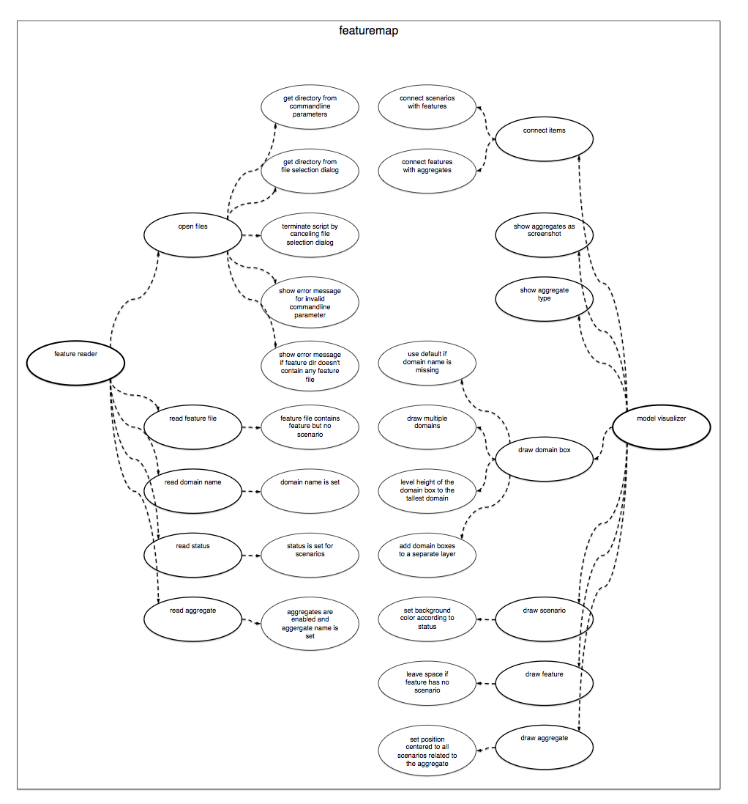
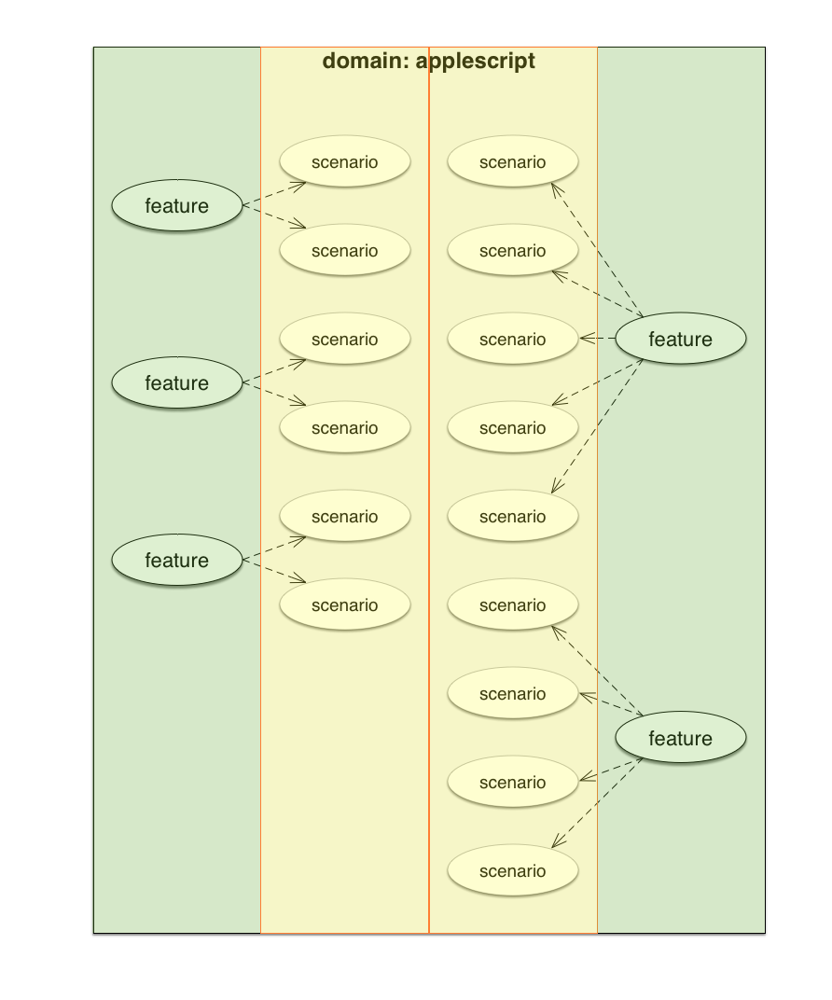
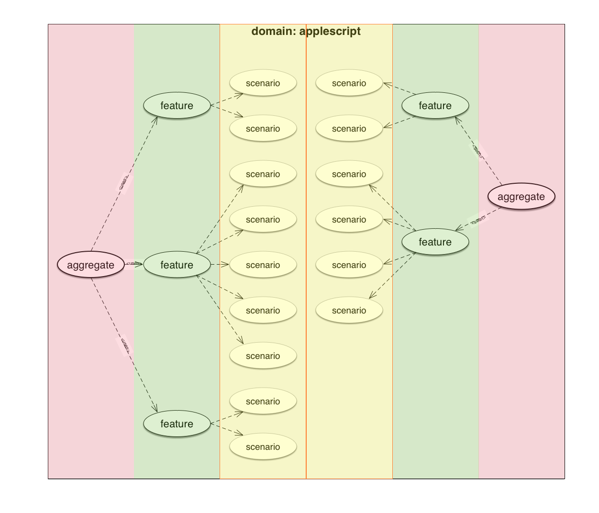
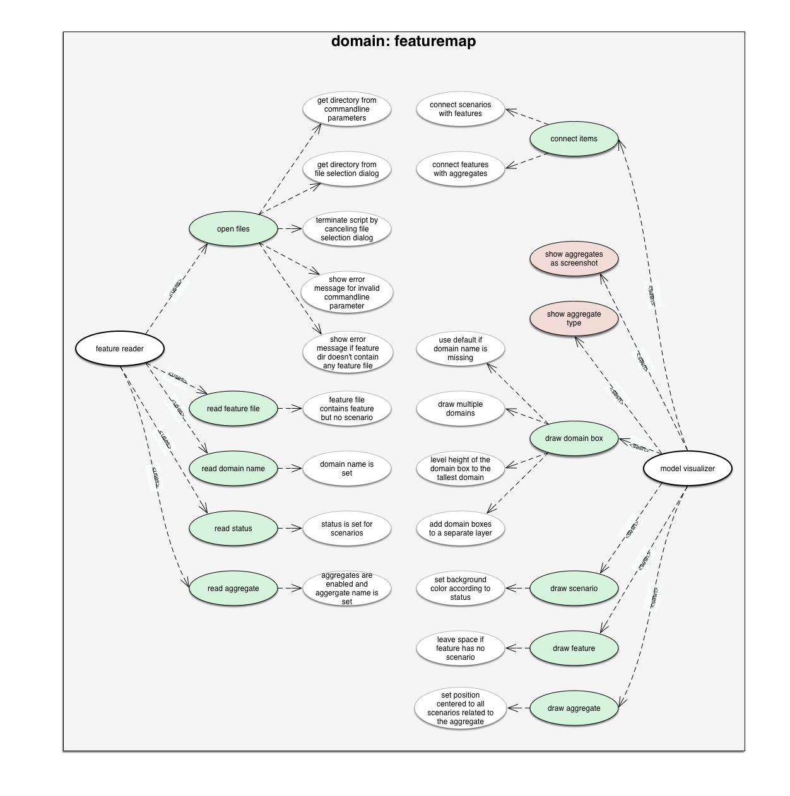

# featuremap

The featuremap script turns BDD feature files into an usecase map using MS Excel and VBA (Viusal Basic for Applications).

## prerequisites

* MS Excel 2011 (Mac) or MS Excel 2007 (Windows) 
* for MAC Excel 2016 see installation notes below
* the script should work with newer version with MS Excel for Windows
* BDD style feature files (just text, one feature per file, like for [Cucumber](https://github.com/cucumber/cucumber/wiki/Feature-Introduction))

#### how to setup featuremap_xl for MAC Excel 2016
Because MAC Excel 2016 is no longer able to access file from inside VBA (e.g. reading .features files) you have to use an external script for this. So please copy the file featuremap_xl.scpt from folder mac_office_2016 from this release to \<root>:\<user>:Library:Application Scripts:com.microsoft.Excel . Hint: on most Macs \<root> is known as "Macintosh HD".

## usage
Open the featuremap_xl.xlsm with macros activated. Click on the "create a new feature map" button. The macro will ask your for the folder containing your .feature files.

As a result your map could look like this:

**Hint:** look for the features folder for this script to try this out!

## background
### motivation

From my understanding [BDD](https://en.wikipedia.org/wiki/Behavior-driven_development) features are made for the development process in the first place. So the regular workflow is define the feature, write a test and develop the code. After a while you end with a lot of features (and scenarios). To get an overview about what your software does you have to read all those features and make an map of them in your mind. That's why I wrote this script. It will generate the map for you. 

##### Why Excel?
You may have noticed that I started with an script for Omnigraffle to be able to modify the script results in a comfortable way. But to make the script availble for more users I was looking for a more common tool. I choose Excel because it has sufficient capabilities for drawing, it has a very powerful scripting support for Mac and Windows  and is quite common among potential users.

### modeling
The default setup is to draw a box with four colums of use case bubbles. Close to the border you will see the features while all the related scenarios are placed inside. Note that the feature bubbles are surrounded by thicker lines.

### more modeling
If you add some more complexity to your software the map starts getting confusing again. But if you practice some [domain driven design](https://en.wikipedia.org/wiki/Domain-driven_design) you might already assign your features to [aggregates](http://martinfowler.com/bliki/DDD_Aggregate.html) and your [aggregates](http://martinfowler.com/bliki/DDD_Aggregate.html) to domains. Wouldn't it be nice tho show them in your map?
If you set the property cDisableAggregates in the head of the script to false the script will assume that you name your features like this **\<aggregate name\> - \<feature name\>**. It will then add another column of use case bubbles between the border of the domain box and the features. As a side effect your are able to order your feature files by aggregate.
To set the domain name you have to follow a different approach. Add a line inside the feature file above the feature name. Add a **@d-** tag in this line (e.g. add @d-presentation to name your domain presentation).

### colored bubbles (not yet available for featuremap_xl)
White backgrounds are boring. So I thought it would be nice to express the current status of a feature or scenario by changing the background. So the script is looking for status tags starting with @s- (e.g. @s-backlog) above a feature or scenario name and changes the background color accordingly. If you check the head of th script you will find some properties to adapt the script to your actual wording. You might also change the colors and the tag syntax.

In this example I've set the status for features only but of course it's possible to set the status for scenarios too.

